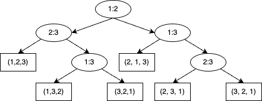

# 정렬
## 선택 정렬
선택 정렬은 정렬 조건에 가장 알맞는 원소부터 선택하여 올바른 위치로 옮기는 작업을 반복해 정렬을 수행하는 알고리즘입니다. 다음은 비교 가능한 타입의 배열을 정렬하는 알고리즘입니다.
``` python
def selection_sort(lst):
    for i in range(len(lst)):
        min = i
        for j in range(i + 1 , len(lst)):
            if lst[j] < lst[min]:
                min = j
        lst[i], lst[min] = lst[min], lst[i]
```
단점은 시간복잡도가 최선의 경우에도 $selection\_ sort \in \Omega(n^2)$입니다. 이미 정렬된 배열에 대해서도 조건에 가장 알맞는 원소를 찾기위해 배열을 탐색해야 하기 때문입니다.

## 삽입 정렬
삽입 정렬은 정렬되지 않은 가장 앞의 원소와 정렬이 완료된 원소들을 앞에서부터 비교해나가며 정렬을 수행합니다. 다음은 배열을 정렬하는 알고리즘입니다.
``` python
def insertion_sort(lst):
    for i in range(1, len(lst)):
        j = i
        tmp = lst[i]
        while j > 0 and lst[j - 1] > tmp:
            lst[j] = lst[j - 1]
            j -= 1
        lst[j] = tmp
```
장점은 이미 정렬된 원소에 새로운 값을 추가하는 경우 $insertion\_ sort \in \Omega(n)$입니다. 단점은 선택 정렬과 마찬가지로 최악의 경우와 평균적인 경우 $insertion\_sort \in O(n^2)$입니다.

## 셸 정렬
셸 정렬은 $n=\frac{length(list)}{2}$칸 떨어진 원소를 정렬하고, 다시 $n=\frac{n}{2}$로 정하여 $n$칸 떨어진 원소를 정렬합니다. 이 때를 $n$-정렬이라고 합니다. 1-정렬까지 모두 수행되었다면 정렬이 완료된 것입니다.
``` python 
def shell_sort(lst):
    n = len(lst)
    h = n // 2
    while h > 0:
        for i in range(h, n):
            j = i - h
            tmp = lst[i]
            while j >= 0 and lst[j] > tmp:
                lst[j + h] = lst[j]
                j -= h
            lst[j + h] = tmp
        h //= 2
```
셸 정렬은 앞서 소개한 정렬들보다 훨씬 빠릅니다. $shell\_ sort \in O(n^{1.25})$라고 알려져 있습니다. 그러나 후술할 정렬 방법보다 빠르지는 않습니다.

## 힙 정렬
힙 정렬은 미리 구현된 힙을 이용하면 아주 간단합니다. 힙에 값을 전부 다 집어넣고 다시 빼면 됩니다.
``` python
def heap_sort(lst):
    pq = PriorityQueue()
    for e in lst:
        pq.push(e)
    
    res = []
    while not pq.empty():
        res.append(pq.get())
    
    return res
```
그래서 힙 정렬에 대해 공부할 때는 정렬 방법에 대해서 공부하기보다는 힙이 무엇이고 어떻게 작동하는지에 대해 공부합니다. 힙은 부모의 값이 자식의 값보다 항상 큰 완전 이진 트리를 의미합니다. 우리가 새로운 값을 힙에 집어넣을 때 힙의 성질을 유지해야 합니다. 이제 이것을 `heapify`함수라고 부릅니다. 우선 리스트를 이용해 배열을 표현해야 합니다. 다른 방법이 있을 수 있지만, 이진 트리를 배열을 사용하여 표현하는 방법은 다음과 같습니다.

1. index 0을 루트노드로 합니다.
2. 2 * index + 1은 왼쪽 자식입니다.
3. 2 * index + 2는 오른쪽 자식입니다.
4. (index - 1) / 2는 해당 노드의 부모입니다.

만약 index 1을 루트노드로 한다면 약간 다릅니다.

1. index 1을 루트노드로  합니다.
2. 2 * index는 왼쪽 자식입니다.
3. 2 * index는 오른쪽 자식입니다.
4. index / 2는 해당 노드의 부모입니다.

예를 들어 `{1, 2, 3, 4, 5, 6, 7, 8}`이라는 배열이 있으면 아래와 같은 트리를 만듭니다.
```
            1
          /   \
        2      3
      /  \    /  \
     4    5  6    7
    /
   8
```
이 때 완전 이진트리란, 마지막 레벨을 제외한 부분은 서브트리까지 꽉 차있는 포화 이진트리이고, 마지막 레벨은 왼쪽부터 순서대로 차있는 이진트리를 의미합니다. 이제 그 중에서도, 부모의 값이 자식의 값보다 큰 완전 이진트리가 바로 힙입니다. 이제 자기 노드 아래를 힙으로 만드는 `heapify` 함수입니다.

``` python 
def heapify(btree, index):
    left = index * 2 + 1
    right = index * 2 + 2
    size = len(btree)
    largest = index
    
    if left < size and btree[left] > btree[index]:
        largest = left
    else:
        largest = index
    
    if r < size and btree[right] > btree[index]:
        largest = right
    else:
        largest = index

    if largest != index:
        btree[index], btree[largest] = btree[largest], btree[index]
        heapify(btree, largest)
```
`heapify`함수는 자신보다 좌우의 자식 중 하나보다 자식이 크다면 제일 큰 자식과 위치를 바꾸고, 바꾼 부분부터 다시 `heapify`를 수행합니다.

이제 힙을 만들어 봅시다.
``` python
def build_max_heap(arr):
    size = len(arr)
    for i in range((size - 1) // 2, -1, -1):
        heapify(arr, i)
```
이렇게 하는 이유는 `heapify`를 수행할 때 양쪽 노드가 둘 다 힙이 아닌 경우가 존재하기 때문입니다. `heapify`는 서브 트리 중 한 쪽만 힙으로 만듭니다. 이제 정렬을 수행합시다.
``` python
def heap_sort(arr):
    size = len(arr)
    build_max_heap(arr)
    for i in range((size - 1) // 2, 0, -1):
        a[0], a[i] = a[i], a[0]
        heapify(arr[:size - i], 0)
```
힙 정렬은 최악의 경우, 평균적인 경우, 최선의 경우 모두 $O(n\log n)$의 성능을 보입니다. 그러나 캐시 지역성을 고려하지 않기 때문에 실제로 사용하기는 어렵습니다. 힙 정렬보다는 힙 자체를 우선 순위 큐 등으로 사용하는 경우가 많습니다. 여기에 `insert_heap`, `change_key`, `maximum`, `extract_max`등의 연산을 추가하여 우선 순위 큐로 활용할 수 있습니다.

## 병합 정렬
병합 정렬은 정렬하고자 하는 배열을 앞부분과 뒷부분으로 재귀적으로 나누어 정렬하는 기법입니다. 배열을 나누고 합치는 과정을 거칩니다.
``` python
def compare(left, right):
    return left < right

def merge_sort(lst, start, end, comp):
    if start == end:
        return
    
    mid = (start + end) // 2
    merge_sort(lst, start, mid, comp)
    merge_sort(lst, mid + 1, end, comp)
    
    i = start
    j = mid + 1
    temp = []
    while i <= mid and j <= end:
        if comp(lst[i], lst[j]):
            temp.append(lst[i])
            i += 1
            continue

        temp.append(lst[j])
        j += 1
    
    while i <= mid:
        temp.append(lst[i])
        i += 1

    while j <= end:
        temp.append(lst[j])
        j += 1

    l = 0
    for k in range(start, end + 1):
        lst[k] = temp[l]
        l += 1
```

## 퀵 정렬
퀵 정렬의 경우 실제 사용 환경에서 정렬 속도가 가장 빠른 알고리즘입니다. 그렇기에 수많은 언어들의 표준 라이브러리에서의 기본 정렬 알고리즘은 퀵 정렬입니다.

``` python
def quick_sort(lst, left, right):
    if left >= right:
        return
    
    pivot = partition(lst, left, right)
    quick_sort(lst, left, pivot - 1)
    quick_sort(lst, pivot, right)

# 분할 방법에는 여러 분할 방법이 있습니다.
# 여기서는 배열의 중앙을 피벗으로 정합니다.
def partition(lst, left, right):
    pivot = lst[(left + right) // 2]

    while left <= right:
        while lst[left] < pivot:
            left += 1
        
        while lst[right] < pivot:
            right += 1
        
        if left <= last:
            lst[left], lst[right] = lst[right], lst[left]
            left += 1
            right -= 1
    
    return left
```
평균적인 경우 $quick\_ sort \in \Theta(n\log n)$이지만, 최악의 경우 $quick\_ sort \in O(n^2)$입니다. 최악의 경우에도 $O(n\log n)$임을 보장하는 다른 알고리즘이 많은데 왜 퀵소트를 사용할까요? 그리고 왜 최악의 경우 $quick\_ sort \in O(n^2)$일까요?

### 분할 문제
예를 들어 어떤 분할의 경우 분할의 왼쪽에 $n-1$개의 원소가 있을 수 있습니다. 이는 전혀 분할이 되지 않은 상태이며, 이러한 경우 마스터 정리에 따라 $O(n^2)$에 속함을 쉽게 알 수 있습니다. 그러나 8:2 분할과 같이 나빠보이는 분할에서도 시간복잡도가 $O(n\log n)$에 속합니다. 따라서 평균적인 시간복잡도가 $\Theta(n\log n)$이 됩니다.

### 분할 문제의 해결 방법
1. 분할의 기준이 될 피벗을 랜덤으로 설정합니다. 이를 랜덤화된 퀵 정렬(randomized quick sort)라고 합니다.
2. 그룹으로 나누고 그룹 안에서 선택하는 방법이 있습니다.
3. 그 외에도 많은 방법이 있지만, 잘못된 분할에 따른 문제가 반드시 발생하지 않을 것이라고는 보장할 수 없습니다.

### 그 외 다른 문제
 퀵 정렬은 원소가 적을수록 좋지 않은 피벗이 선택될 가능성이 높아집니다. 따라서 많은 라이브러리에서 원소가 적은 경우 삽입 정렬을 대신 이용하기도 합니다.

### 퀵 정렬이 다른 정렬에 비해 빠른 이유
퀵 정렬은 다른 정렬에 비해 아주 빠릅니다. 시간 복잡도가 $O(n\log n)$인 다른 알고리즘과 비교할 때 몇 가지 이점이 있습니다.

1. 캐시 지역성: 힙 정렬과 같은 정렬은 캐시 지역성을 무시하는 방향으로 작동합니다. 그러나 퀵 정렬은 피벗을 찾을 때 배열의 순서대로 접근을 시도하므로 캐시 지역성의 지역성을 지키는 방식으로 작동합니다.

2. 메모리: 퀵 정렬은 구현에 따라 다르나, 스택 메모리 이외의 추가적인 메모리 공간을 필요로 하지 않습니다. 메모리 할당에 따른 오버헤드가 적습니다.

3. 최악의 경우: 최악의 경우는 잘 발생하지 않습니다. 서로 다른 원소들이 있을수록 특정한 입력 때문에 최악의 경우로 동작하는 일이 적어지기 때문입니다. 앞에서 소개한 랜덤화된 퀵 정렬의 경우 최악의 경우가 잘 발생하지 않으며, 발생하기 쉬운 경우에도 다른 정렬 알고리즘을 섞어 사용하기도 합니다. 

# 선형 시간 정렬
## 정렬의 상한과 하한
우리가 앞에서 보았던 정렬은 원소를 서로 비교하여 정렬을 수행합니다. 이를 **비교 정렬**이라고 합니다. 한 가지 재미있는 사실은 어떤 비교 정렬 알고리즘이더라도 최악의 경우 비교를 $\Omega(n \log_2 n)$번 해야 합니다.

### 증명
증명을 위해 결정 트리를 사용합니다. 우리는 두 원소를 비교해서 정렬을 수행합니다. 비교의 각 단계마다 두 원소의 위치를 바꿀지, 아니면 바꾸지 않을 지 선택합니다.



위 트리에서 두 원소를 비교해서 왼쪽이 크면 오른쪽 자식노드로 진행하고, 오른쪽이 크거나 같으면 왼쪽 자식노드로 진행합니다. 이 과정을 모두 거쳤을 때, 어떤 정렬의 결과인 리프노드의 갯수가 $n!$개 라는 사실을 알 수 있습니다. 효율적인 정렬 알고리즘은 이 경로 중 하나만을 택하므로, 비교 횟수는 트리의 높이가 됩니다. 원소 $n$개에 대한 비교 정렬에 대응하는 높이가 $h$인 이진 트리의 리프 개수는 $2^h$개를 넘지 않으므로 다음을 만족합니다.
$$
\begin{align*}
& n! \le l \le 2^h \\
\end{align*}
$$
이 때 트리의 높이는 $\log_2 n!$보다 작을 수 없고, 정렬의 하한은 $\Omega(n\log n)$ 입니다. 또한 정렬의 상한을 알 수 있는데, 결정 과정이 정해져있다면 (즉, 랜덤이 아니라면) 아무리 정렬 알고리즘이 느리더라도 $O(n!)$은 넘지 않음을 추측할 수 있습니다.

## 선형 시간 정렬
그렇다면 비교를 사용하지 않고 정렬을 수행한다면, 선형시간 안에 정렬할 수 있지 않을까요? 실제로 그런 알고리즘이 몇 개 있습니다.

### 계수 정렬
계수 정렬은 정렬하고자 하는 리스트의 누적 도수를 이용해서 정렬을 수행하는 알고리즘입니다. 일단 리스트의 누적 도수를 만들고, 앞에서부터 차례대로 다른 배열에 적으면 정렬이 완료됩니다. 해당 수의 범위가 $[0, k]$라고 했을 때 $O(n+k)$의 시간이 걸립니다.

```python 
def counting_sort(lst, k):
    temp = [0 for _ in range(k + 1)]
    for i in lst:
        temp[i] += 1
    
    result = []
    for i in range(len(temp)):
        if temp[i] != 0:
            while temp[i] > 0:
                temp[i] -= 1
                result.append(i)

```

이 외에도 버킷 정렬이나, 기수 정렬 등 여러 가지 선형 시간 정렬들이 있습니다.
