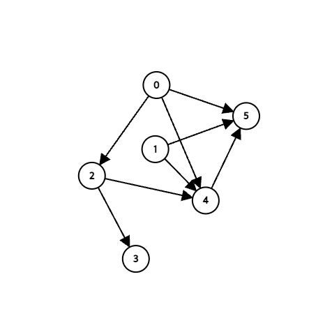

# 그래프
## 개념
그래프(graph)는 그래프 이론에서 무방향 그래프(undirected graph)와 방향 그래프(directed graph)의 개념을 구현하기 위한 추상 자료형을 의미합니다. 그래프는 정점(vertex, 혹은 node)의 집합과 간선(edge)의 집합으로 이루어져 있습니다.

무방향 그래프에서는 간선을 순서가 없는 쌍(pair)으로 나타내고, 방향 그래프에서는 간선을 순서가 있는 쌍으로 나타냅니다. 다음은 6개의 정점과 8개의 간선을 가지는 방향 그래프입니다.



## 트리의 표현
트리를 표현하는 방법은 대표적으로 두 가지 방법이 있습니다. 하나는 인접 행렬(adjacency matrix)을 이용하는 방법, 다른 하나는 인접 리스트(adjacency list)를 이용하는 방법이 있습니다.

### 인접 행렬
인접 행렬을 이용하는 방법은 그래프를 행렬로 표현하는 방법입니다. 인접 행렬의 행 번호와 열 번호는 각각의 노드를 표현합니다. 예를 들어 아래와 같은 인접 행렬이 있다고 가정합시다.

```
0 0 1 0 1 1
0 0 0 0 1 1
0 0 0 1 1 0
0 0 0 0 0 0
0 0 0 0 0 1
0 0 0 0 0 0
```
이 행렬에서 (1, 3)은 1번 노드에서 3번 노드로 향하는 간선을 의미합니다. 따라서 상기 행렬은 방향 그래프를 나타내고 있다는 사실을 유추할 수 있습니다. 그리고 `i = j`인 경우 자기 자신으로 향하는 간선이 되겠습니다.

#### 장점
1. 두 노드의 연결 상태를 알아내는 연산이 간단합니다.

#### 단점
1. 인접 노드가 무엇인지 알아내기 위해서는 행렬 전체를 탐색해야합니다.
2. 인접 행렬을 생성하는 작업의 시간 복잡도가 $O(n^2)$입니다.

### 인접 리스트
인접 리스트를 이용하는 방법은 그래프를 인접 노드의 리스트로 표현하는 것입니다. 방금의 인접 행렬을 인접 리스트로 바꾸어 보겠습니다.

```
1 [] -> [3, 5, 6]
2 [] -> [5, 6]
3 [] -> [4, 5]
4 []
5 [] -> [6]
6 []
```
이 리스트의 이름을 `graph`이라고 한다면 `graph[1][1]`은 1번 노드에서 3번 노드로 향하는 간선을 의미합니다.

#### 장점
1. 인접 리스트를 생성하는 작업이 선형 시간이 걸리므로 빠릅니다.
2. 인접 노드를 알기 위해서 해당 노드의 리스트만 가져오면 됩니다.

#### 단점
1. 두 정점의 연결 상태를 알아내려면 선형 탐색을 수행해야 합니다.

일반적으로 간선이 많을수록 인접 행렬이 유리하고, 정점이 많을수록 인접 리스트가 유리합니다.

## 탐색
그래프를 탐색하는 방법은 여러가지 방법이 있지만, 대표적으로 깊이 우선 탐색(depth-first search, DFS)과, 너비 우선 탐색(breadth-first search, BFS)이 있습니다.

### 깊이 우선 탐색
깊이 우선 탐색은 다음 이미지와 같이 시작 정점의 먼 부분을 우선적으로 탐색하는 방법입니다. 만약 그래프의 일정 깊이에 대한 연산이 들어가야 한다면 깊이 우선 탐색을 이용하는 것이 유리합니다.


#### 구현
구현은 스택을 이용하는 방법과 재귀를 이용하는 방법이 있습니다. 하지만 재귀 방식은 잠재적으로 스택을 사용하므로 두 방법은 동일합니다. 그러나 두 방법에서 서로의 결과가 약간 다를 수 있습니다.

``` python
# 인접 리스트 형태로 그래프가 저장되어 있다고 가정합니다.
graph = []  

# 방문했는지에 대한 여부를 확인합니다.
# visited 배열이 없다면 순환하는 형태의 그래프(사이클)에서 문제가 생깁니다.
visited = [False * num_nodes]

def recursive_dfs(startsAt):
    for i in range(len(graph[startsAt])):
        if visited[i] == False:
            visited[i] = True
            recursive_dfs(i)

def stack_dfs(startsAt):
    stack = []
    stack.append(startsAt)

    while not stack:
        next_node = stack.pop()
        
        for i in range(len(graph[next_node])):
            if visited[i] == False:
                visited[i] = True
                stack.append(graph[next_node][i])
```
탐색 전략은 동일하지만, 두 함수의 탐색 순서가 서로 다를 수 있음을 상기하세요.

### 너비 우선 탐색
너비 우선 탐색은 시작 정점에 가까운 부분부터 순회하는 방법입니다. 미로 탐색과 같이 상하좌우를 먼저 탐색해야 한다면 너비 우선 탐색을 이용하는 것이 유리합니다.


### 시간 복잡도
두 방법 모두 노드를 한 번은 방문해야 하고, 방문한 노드를 다시 방문하지 않으므로, 시간 복잡도는 $O(|V| + |E|)$입니다.