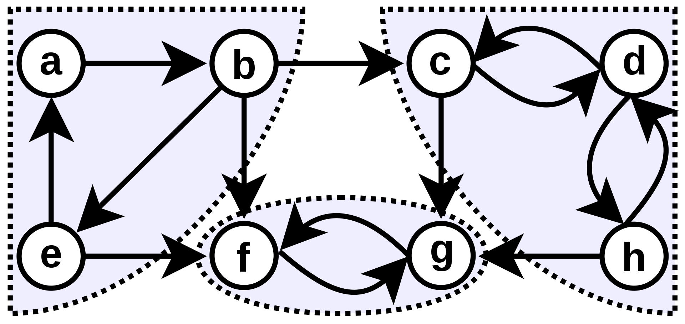

# 그래프 알고리즘
## 강한 연결 요소
방향 그래프에서 "강하게 연결되다"라는 뜻은 어떤 그래프가 **상호 연결**되었다는 뜻입니다. 만약 정점 $v_1$과 $v_2$가 강하게 연결되었다면, $v_1$에서 $v_2$로 가는 경로가 있고, $v_2$에서 $v_1$로 가는 경로가 있음을 의미합니다. 그리고 $v_i$는 자기 자신과 강하게 연결됩니다.


$\{a, b, e\}, \{c, d, h\}, \{f, g\}$는 강한 연결 요소(strongly connected component)입니다.

### 코사라주의 방법
1. 방문하지 않은 각 정점에 대해 DFS를 수행합니다. 탐색이 끝난 노드부터 스택에 넣습니다.
2. 그래프를 전치합니다.
3. 이제 스택에서 가장 위에 있는 $s_e$을 빼고 $s_e$부터 전치 그래프에 대한 DFS를 수행합니다. 한 번의 탐색에서 탐색된 정점은 하나의 SCC입니다.

### 타잔의 방법
(작성중...)

## 최소 신장 트리
신장 트리란 그래프 내의 모든 정점을 포함하는 트리를 일컫습니다. 그 중에서도 최소 신장 트리는 가중치의 합이 최소인 신장 트리를 의미합니다. 최소 신장 트리를 찾는 알고리즘은 어떤 그래프에서 모든 정점을 최소 비용으로 잇고 싶을 때 유용하게 사용될 수 있습니다.

### 크루스칼 알고리즘
크루스칼 알고리즘은 탐욕법을 이용해 최소 신장 트리를 만듭니다.
1. 그래프의 간선을 가중치의 오름차순으로 정렬한다.
2. 가장 낮은 가중치의 간선을 선택하면서도, 사이클을 형성하지 않는 간선을 선택한다.
3. 선택된 간선은 이제 최소 신장 트리의 일부이다.

여기서 가장 낮은 가중치의 간선을 선택하는 것은 아주 쉽지만, 사이클을 형성하지 않는 간선인지의 여부를 파악하는 것은 쉽게 생각할 수 없습니다. 2번 과정으로 선택된 간선이 최소 신장 트리에 포함이 되지 않고 다른 경로가 될 수도 있지 않을까요?

#### 새로 추가된 간선이 사이클을 형성하는지에 대한 여부 판단하기
정점의 집합을 두개의 집합 $S$, $V-S$로 나눌 수 있습니다. 이를 **절단**이라고 합니다. 그리고 단절을 통해 나누어진 두 집합에 연결된 간선이 존재하면 두 집합이 **교차**한다고 말합니다. 만약 선택된 간선 중 그러한 간선이 없다면 그 간선의 집합을 **따른다** 라고 표현합니다. 어떤 간선이 절단을 교차하는 간선 중 가중치가 가장 작은 간선을 **경량 간선**이라고 합니다.

정점의 집합을 두개의 집합으로 나누어 봅시다. 하나는 선택된 집합이고, 다른 하나는 선택되지 않은 집합입니다. 만약 새로운 간선을 선택할 때 그 간선의 양 끝이 모두 선택된 집합에 있는 정점을 가리키고 있다면 이는 사이클을 형성할 것입니다. 즉, 우리는 **절단**된 두 집합을 잇는 간선을 찾으면, 그 간선은 사이클을 만들지 않음을 알 수 있습니다.

#### 간선 찾기 
이미 만들어진 최소 신장 트리가 있다고 가정합시다. 그리고 그 신장트리의 아무 곳을 끊어봅시다. 만약 끊어진 곳이 신장 트리를 만드는 유일한 경로라면 반드시 포함되야 함이 자명합니다. 그렇지 않고 신장 트리를 만드는 새로운 경로가 있다고 합시다. 이렇게 새로 만들어진 신장 트리는 다른 부분은 같고 교차하는 간선만 다릅니다. 그러면 새로 만들어진 신장 트리의 가중치의 합은 기존 신장 트리의 가중치의 합보다 작을 수 없습니다. 왜냐하면 우리가 끊은 간선은 경량 간선이기 때문입니다.

#### 유니온-파인드 알고리즘 (서로소 집합 알고리즘)
이제 선택된 노드를 모두 한 집합으로 만들어야 합니다. 어떻게 하면 그렇게 할 수 있을까요? 절단된 두 집합은 기본적으로 서로소 집합입니다. 따라서 서로소 집합을 컴퓨터 상에서 구현하고 사용한다면 구현할 수 있습니다.

``` python
parent = [0, 1, 2, 3, 4, 5, 6, 7, 8, 9, 10]

def find(x):
    if parent[x] != x:
        return find(parent[x])
    return x

def find_quick(x):
    if parent[x] != x:
        return parent[x] = find_quick(parent[x])
    return parent[x]

def union(a, b):
    a = find(a)
    b = find(b)
    if a < b:
        parent[b] = a
    else:
        parent[a] = b
```
이 알고리즘에서 주의할 점은 만약 집합을 분리하는 알고리즘이 필요한 문제를 풀 때 반드시 부모에 해당하는 값을 갱신해줘야 합니다. 예를 들어 `0, 1, 2, 3` 노드가 있고 `union(2, 3)`, `union(1, 2)`을 수행하면 `1, 2, 3`은 모두 같은 집합에 속하지만 `parent = [0, 1, 1, 2]`가 됩니다.

만약 후술할 프림 알고리즘과 크루스칼 알고리즘 중에 하나만을 사용해야 한다면 크루스칼 알고리즘을 쓰는 것이 좋습니다. 알고리즘이 구현하기 쉽기 때문입니다. 하지만 몇몇 문제는 풀리지 않는데, 이는 크루스칼 알고리즘은 $O(E \log V)$, 프림 알고리즘은 $O(V^2)$ 혹은 $O((V+E)\log V)$ 혹은 $O(E+V\log V)$의 시간 복잡도를 갖기 때문입니다.

### 프림 알고리즘
프림 알고리즘 또한 크루스칼 알고리즘과 마찬가지로 탐욕적으로 간선을 선택 해나가며 최소 신장 트리를 완성하는 알고리즘입니다.

정점 하나를 선택하여 집합을 만듭니다. 이제 이 집합과 이어지는 간선 중 가장 작은 것을 찾습니다. 그 간선이 최소 신장 트리를 이루는 간선 중 하나가 됩니다. 이를 `정점의 수 - 1`만큼 반복하면 최소 신장 트리를 만들 수 있습니다.

``` python
def prim(graph):
    key = [sys.maxsize] * len(graph)
    parent = [-1] * len(graph)
    mst_set = [False] * len(graph)
    pq = [(0, 0)]

    key[0] = 0

    while pq:
        _, u = heapq.heappop(pq)
        mst_set[u] = True

        for v in range(len(graph)):
            if graph[u][v] and not mst_set[v] and graph[u][v] < key[v]:
                key[v] = graph[u][v]
                parent[v] = u
                heapq.heappush(pq, (key[v], v))
```
## 단일 출발지 최단 경로
하나의 출발 지점에서 각 정점에 도달하는 최단 경로를 구하는 방법입니다.

### 최단 경로 알고리즘의 특성
최단 경로 알고리즘은 두 정점 사이의 최단 경로 문제가 다른 최단 경로 문제를 포함하고 있음을 이용합니다. 간단하게 말하면, 최단 경로의 모든 부분 경로는 최단 경로 입니다. 어떤 최단 경로 $p$가 있을 때 그 사이의 경로 $p^\prime$은 최단 거리여야 합니다. 그렇지 않고 가중치가 더 작은 다른 경로 $p^{\prime \prime}$이 있다면 이는 $p$가 최단 경로가 아님을 의미합니다.

### 완화
단일 출발지 최단 경로 알고리즘은 도착지에 대한 경로를 탐색하며 거리를 지속적으로 개선시킵니다. 이 작업을 완화(relaxation)라고 합니다. 먼저 각 정점에 대해 거리를 무한으로 초기화 합니다.

``` python
def init_single_source():
    for vertex in graph:
        vertex.distance = ∞
        vertex.prev = None

startsAt.distance = 0
```
그리고 계속해서 아래 작업을 수행합니다.

``` python
def relax(u: vertex, 
          v: vertex, 
          w: Callable[[vertex, vertex], int]):
    if v.distance > u.distance + w(u, v):
        v.distance = u.distance + w(u, v)
        v.prev = u
```
우리가 알아볼 **데이크스트라의 방법**과 **벨만과 포드의 방법**은 이러한 `relax`를 사용합니다.

### 벨만과 포드의 풀이
이 풀이에서는 음의 가중치를 갖는 사이클은 허용하지 않지만, 가중치가 음인 단순 경로는 포함할 수 있습니다.

``` python
def find_shortest_path(graph, startsAt):
    for i in range(1, len(graph.vertices)):
        for u, v in graph.edges:
            relex(u, v, w)
    for u, v in graph.edges:
        if v.distance > u.distance + w(u, v):
            return False
    return True
```
그래프의 각 간선에 대해 $|V|-1$번 완화를 수행합니다. 그 이후에 음의 가중치를 갖는 사이클이 존재하는지 확인합니다. 만약 음의 가중치를 갖는 사이클이 존재한다면 최단 경로를 찾을 수 없습니다.

### 데이크스트라의 풀이
이 풀이에서는 가중치가 음인 단순 경로 또한 포함할 수 없습니다. 간선의 가중치는 항상 양수가 되어야 합니다. 그렇지 않으면 잘못된 결론을 도출할 수 있습니다. 음의 가중치를 허용하지 않는 대신 벨만과 포드의 풀이보다 더 빠르게 최단 경로를 찾습니다.

원래 풀이에서는 우선 순위 큐를 사용하지 않았지만, 우선 순위 큐를 사용한다면 더 빠르게 작동합니다.
``` python
def find_shortest_path(graph, 
                       startsAt: vertex, 
                       w: Callable[[vertex, vertex], int]):
    S = []
    Q = initialize_heap_with_list(graph.vertices)
    while not Q.empty():
        u = Q.get()
        s.append(u)
        for vertex in graph.adj[u]:
            relax(u, v, w)
```

### 실제 사용에서
빠르고 정확하게 풀어야 하는 문제 풀이 상황에서는 그래프를 이정도로 자세하게 만들기 어렵습니다. 따라서 거리 리스트를 따로 만들기도 합니다.

``` python
import heapq
graph = {
    1: {2: 1, 3: 2, 4: 5}
    2: {1: 3}
    3: {2: 3, 1: 2, 4: 1}
    4: {}
}

distance = [float('inf') for _ in range(5)]
def find_shortest_path(graph, startsAt):
    pq = []
    distance[startsAt] = 0
    heapq.heappush(pq, [distance[startsAt], start])

    while queue:
        dist, dest: heapq.heappop(pq)

        if distance[dest] < dist:
            continue
        
        for new_dest, new_dist in graph[dist].items():
            via = dist + new_dist
            if via < distance[new_dest]:
                dist[new_dest] = via
                heapq.heappush(pq, [via, new_dest])
```

단일 출발지 최단 경로 문제는 네트워크에서 라우팅 문제를 해결하는데 해결할 수 있습니다. 현 위치에서 목적지까지 가장 짧은 경로를 찾는데 사용됩니다.

## 모든 쌍 최단 경로
이제 모든 쌍에 대한 최단 경로를 구해야 하는 경우가 있습니다.

### 플로이드 워셜 알고리즘
플로이드 워셜 알고리즘은 동적 계획법을 이용하여 모든 쌍에 대한 최단 경로를 찾습니다. 일단 그래프가 인접 행렬로 표현되어 있다고 가정합시다.
``` python
def all_pair_shortest_path(graph):
    result = copy(graph)
    size = len(result)
    for _via in range(size):
        for _from in range(size):
            for _to in range(size):
                dist = result[_from][_via] + result[_via][_to] 
                if result[_from][_to] > dist :
                    result[_from][_to] = dist
```
조금 눈치가 빠른 사람이라면 행렬곱 알고리즘과 비슷한 연산을 한다는 사실을 곧바로 알 수 있습니다.