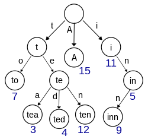
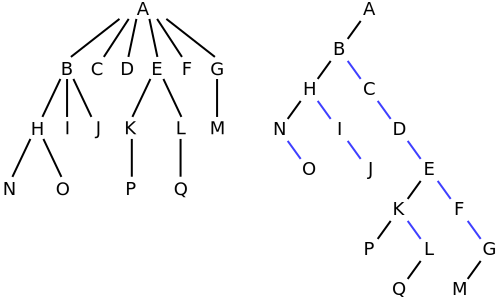

# 트리
## 개념
트리는 상하관계를 나타내는데 사용되는 추상 자료형입니다. 트리는 노드(node)와 가지(branch, edge)로 이루어져 있습니다. 즉, 트리는 그래프의 집합의 원소입니다.

1. 루트: 트리의 가장 위쪽에 있는 노드
2. 리프: 자식이 없는 노드
3. 비단말 노드: 리프 노드가 아닌 노드
4. 자식: 어떤 노드와 가지가 연결되었을 때 아랫쪽 노드
5. 부모: 어떤 노드와 가지가 연결되었을 때 위쪽 노드
6. 형제: 부모가 같은 노드
7. 조상: 어떤 노드의 상위 노드들, 루트 노드는 모든 노드의 조상입니다.
8. 자손: 어떤 노드의 하위 노드들, 루트 노드가 아닌 노드는 루트 노드의 자손입니다.
9. 레벨: 루트에서 얼마나 떨어져 있는가?
10. 차수: 각 노드가 갖는 자식의 수 중 제일 큰 것
11. 높이: 루트에서 가장 멀리 있는 리프까지의 길이
12. 서브트리: 어떤 노드를 루트로 하고 그 자손으로 구성된 트리
13. 빈 트리: 노드와 가지가 전혀 없는 트리
14. 포레스트: 서로 다른 루트를 가진 트리들의 모임

## 순회
마찬가지로, 트리 순회에도 여러 전략들이 있습니다. 대표적으로 전위 순회, 중위 순회, 후위 순회가 있습니다. 아래 예제에서는 이진 트리(트리의 차수가 2인 트리)를 순회합니다.

### 전위 순회
``` python
def preorder(node):
    print(node.name)
    if node.left:
        preorder(node.left)
    if node.right:
        preorder(node.right)    
```

### 중위 순회
```python
def inorder(node):
    if node.left:
        inorder(node.left)
    print(node.name)
    if node.right:
        inorder(node.right)    
```

### 후위 순회
```python
def postorder(node):
    if node.left:
        postorder(node.left)
    if node.right:
        postorder(node.right)
    print(node.name)    
```

이제 다양한 종류의 트리를 알아봅시다.

## 트리의 종류
### 이진 트리


이진트리는 트리의 차수가 2인 트리를 의미합니다. 즉 각 노드는 왼쪽 자식과 오른쪽 자식만을 가집니다. 루트부터 시작해 마지막 레벨 전까지는 모든 노드가 차있고 같은 레벨 안에서는 왼쪽에서 오른쪽으로 노드가 채워진 트리를 **완전 이진 트리**라고 합니다. 이진 트리는 단순하지만 가장 중요한데, 모든 트리는 이진 트리로 변환될 수 있기 때문입니다. 이에 대해서는 후술합니다.

### 이진 검색 트리
이진 검색 트리는 검색을 위해 특별한 규칙을 적용하여 만들어진 트리입니다.
1. 왼쪽 서브트리의 키 값은 자신의 키 값보다 작습니다.
2. 오른쪽 서브트리의 키 값은 자신의 키 값보다 큽니다.

이 규칙을 이용하여 트리를 구성하면 검색을 수행할 때의 시간복잡도를 $O(n)$에서 $O(\log n)$으로 크게 줄일 수 있습니다. 그리고 중위 순회를 수행하면 쉽게 모든 키 값을 오름차순으로 얻을 수 있습니다.

그러나 전통적인 이진 검색 트리는 모든 노드가 한 쪽으로만 이어져 있는 최악의 상황에서 탐색에 $O(n)$ 시간이 걸리는 문제가 있습니다. 이러한 문제를 해결하기 위해 레드 블랙 트리, AVL 트리 등을 이용합니다. 이 트리들은 알아서 트리의 좌우 균형을 맞춥니다. 이를 자가 균형 이진 트리(self-balanced binary tree)라고 부릅니다.

### 세그먼트 트리
세그먼트 트리(segment tree)는 어느 특정 간격에 대한 정보를 저장하기 위해서 사용됩니다. 간격에 대한 연산은 그 특성상 선형 시간이 소요되는데, 작은 영역에 대해서는 빠르지만 거대한 영역에 대해서는 연산이 조금 느립니다. 이 문제를 해결하기 위해 세그먼트 트리를 이용하면 $O(\log n)$ 시간에 연산을 완료할 수 있습니다.

### 트라이
트라이(trie)는 여러 문자열이나 키값들을 효율적으로 저장하고 검색하는데 사용되는 자료구조입니다. 1959년에 트라이라는 개념이 소개되었고 지금까지도 유용하게 사용되고 있습니다. 트라이에 키의 길이가 $k$인 키를 넣으면 탐색과 삽입의 시간복잡도가 $O(k)$입니다. 트라이는 자동 완성, 수많은 문자열의 정렬, 전문 검색 등에 사용됩니다.



이 트라이는 `["A", "to", "tea", "ted", "ten", "i", "in", "inn"]`을 키로 두고 있는 트라이입니다.

트라이는 아래와 같이 구현할 수 있습니다.
``` python
from collections import defaultdict
class Node:
    def __init__(self):
        self.is_word = False
        self.children = defaultdict(Node)

class Trie:
    def __init__(self):
        self.root = Node()
    
    def insert(self, word):
        node = self.root
        for c in word:
            node = node.children[c]
        node.word = True
    
    def search(self, word):
        node = self.root
        for c in word:
            if c not in node.children:
                return False
            node = node.children[c]
        
        return node.is_word
    
    def startsWith(self, prefix):
        node = self.root
        for c in prefix:
            if c not in node.children:
                return False
            node = node.children[c]
        
        return True
```
### Left Child Right Sibling 트리
말 그대로 노드의 좌측에는 자식들이, 노드의 우측에는 형제들이 있는 트리입니다. 앞서 언급하였듯 모든 트리는 이진 트리로 변경될 수 있습니다. 다음은 차수가 6인 트리를 이진 트리로 변환하는 과정입니다.


1. 먼저 트리를 45도 기울입니다.
2. 첫 번째 자식으로 향하는 간선만 남기고 모든 간선을 지웁니다.
3. 이제 자식끼리 간선으로 연결합니다.
4. 이를 트리 전체에 적용합니다.

이 외에도 B-tree, B+ tree, B* tree, 압축 트라이 등 수많은 트리가 있으나 모두 적을 수 없기에 생략합니다.

## 이진 검색 트리 구현
```python
class Node:
    def __init__(self, key, value, left, right):
        self.key = key
        self.value = value
        self.left = left
        self.right = right

class BinarySearchTree:
    def __init__(self):
        self.root = None

    def search(self, key):
        p = self.root
        while True:
            if p is None:
                return None
            if key == p.key:
                return p.value
            elif key < p.key:
                p = p.left
            else:
                p = p.right
    
    def add(self, key, value):
        def add_node(node, key, value):
            if key == node.key:
                return False
            elif key < node.key:
                if node.left is None:
                    node.left = Node(key, value, None, None)
                else:
                    add_node(node.left, key, value)
            else:
                if node.right is None:
                    node.right = Node(key, value, None, None)
                else:
                    add_node(node.left, key, value)
            return True
        
        if self.root is None
            self.root = Node(key, value, None, None)
            return True
        else:
            return add_node(self.root, key, value)
    
    def min_key(self):
        if self.root is None:
            return None
        p = self.root
        while p.left is not None:
            p = p.left:
        return p.key

    def max_key(self):
        if self.root is None:
            return None
        p = self.root
        while p.right is not None:
            p = p.right
        return p.key

    def dump(self):
        def print_subtree(node: Node):
            if node is not None:
                print_subtree(node.left)
                print(f"{node.key} {node.value}")
                print_subtree(node.right)
        print_subtree(self.root)
    
    def remove(self):
        p = self.root
        parent = None
        is_left_child = False
        while True:
            if p is None:
                return False
            
            if key == p.key:
                break

            parent = p
            if key < p.key:
                is_left_child = True
                p = p.left
            else:
                is_left_child = False
                p = p.right

            if p.left is None:
                if p is self.root:
                    self.root = p.right
                elif is_left_child:
                    parent.left = p.right
                else:
                    parent.right = p.right
            elif p.right is None:
                if p is self.root:
                    self.root = p.left
                elif is_left_child:
                    parent.left = p.left
                else:
                    parent.right = p.left
            else:
                parent = p
                left = p.left
                is_left_child = True
                while left.right is not None:
                    parent = left
                    left = left.right
                    is_left_child = False

                p.key = left.key
                p.value = left.value
                if is_left_child:
                    parent.left = left.left
                else:
                    parent.right = left.left
            return True 
```