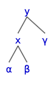
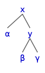

# 레드 블랙 트리
## 이진 검색 트리의 문제점
이진 검색 트리를 이용하면 검색, 삽입, 삭제, 갱신을 $O(\log n)$의 점근적 시간에 처리할 수 있습니다. 그러나 이미 정렬된 배열을 앞에서부터 순차적으로 넣는다면 트리의 좌우 균형이 무너져서 연결 리스트와 비슷하게 앞서 언급한 연산들을 수행하는데 $O(n)$시간이 걸리는 문제가 있습니다.

만약 삽입과 삭제 연산을 수행할 때 트리의 좌우 균형을 맞추는 이진 트리가 있다면 이러한 문제를 해결할 수 있습니다. 이를 자가 균형 트리라고 합니다. 가장 처음 소개된 자가 균형 트리는 **AVL 트리**입니다. AVL 트리는 노드의 균형 지수를 확인한 뒤 트리를 좌우로 회전시키며 불균형을 해소합니다. 여기서 균형지수란, 왼쪽 자식과 오른쪽 자식의 높이차이를 의미합니다. AVL 트리에서는 균형지수는 반드시 -1, 0, 1 중 하나여야 합니다. 
1. 만약 노드가 왼쪽으로 치우쳐진 경우(+2) 노드를 오른쪽으로 회전시킵니다. 
2. 만약 노드가 오른쪽으로 치우쳐진 경우(-2) 노드를 왼쪽으로 회전시킵니다. 
3. 노드가 왼쪽으로 치우쳐 있지만 자식은 오른쪽으로 치우친 경우 왼쪽으로 회전하고 오른쪽으로 회전합니다.
4. 노드가 오른쪽으로 치우쳐 있지만 자식은 왼쪽으로 치우친 경우 오른쪽으로 회전하고 왼쪽으로 회전합니다. 

AVL 트리에서는 상기 4개의 규칙만으로 균형을 맞춥니다. 이후 소개된 자가 균형 이진트리는 바로 **Red-black 트리**입니다. 레드 블랙 트리는 AVL 트리만큼 균형을 엄격하게 맞추지 않습니다. 그리고 구현이 AVL 트리에 비해 훨씬 복잡합니다. 따라서 레드 블랙 트리는 삽입과 삭제 연산이 잦은 상황에 유용합니다. 그래도 여전히 레드 블랙 트리의 높이는 $2\log_2 (n + 1)$를 넘지 않습니다. 레드 블랙 트리는 아래와 같은 제약 조건이 있는 트리입니다.

1. 모든 노드는 적색이거나 흑색이다.
2. 루트는 흑색이다.
3. 모든 리프(nil 노드 혹은 NULL)는 흑색이다.
4. 노드가 적색이면 그 노드의 자식은 모두 흑색이다.
5. 각 노드로부터 그 노드의 자손인 리프로 가는 경로들은 같은 수의 흑색 노드를 포함한다.

이제 노드를 삽입하거나 삭제할 때 이러한 제약을 위반하게 됩니다. 이제 이러한 제약조건을 다시 만족하도록 재구성하면 균형이 잡힌 이진트리를 얻을 수 있습니다.

## 시작하기 전에
레드 블랙 트리와 그 노드들이 아래처럼 구성되어 있다고 가정합니다.
``` c
typedef enum { RBTREE_RED, RBTREE_BLACK } color_t;

typedef int key_t;

typedef struct node_t {
  color_t color;
  key_t key;
  struct node_t *parent, *left, *right;
} node_t;

typedef struct {
  node_t *root;
  node_t *nil;
} rbtree;

```
## 회전
레드 블랙 트리는 AVL 트리와 마찬가지로 이진 검색 트리의 특성을 보존하면서 회전을 수행합니다. 삽입과 삭제는 트리를 수정하기 때문에 자연스럽게 제약조건을 위반합니다. 삽입 시에는 항상 레드 노드를 넣기 때문에, 보통 4번 제약조건을 위반합니다. 이를 복구하기 위해서 트리 내의 일부 노드의 색과 연결 관계를 바꾸어야 합니다.



이제 노드 `y`를 기준으로 오른쪽으로 회전해봅시다. 그러면 `x`의 오른쪽 자식이 `y`의 왼쪽 자식이 됩니다. 그리고 `y`가 `x`의 왼쪽 자식이 됩니다.



마찬가지로 노드 `x`를 기준으로 왼쪽으로 회전하면 처음으로 되돌아 오게 됩니다.

## 삽입
삽입은 일반적인 이진 검색 트리에서의 삽입과 크게 다르지 않습니다.
``` c
node_t *rbtree_insert(rbtree *t, const key_t key) {
  node_t *parent = t->nil;
  node_t *cursor = t->root;
  while (cursor != t->nil) {
    parent = cursor;
    if (key < cursor->key) {
      cursor = cursor->left;
      continue;
    }
    cursor = cursor->right;
  }

  node_t *node = new_node__(t, key);
  node->parent = parent;
  if (parent == t->nil) {
    t->root = node;
  } else if (node->key < parent->key) {
    parent->left = node;
  } else {
    parent->right = node;
  }

  // 여기에서, 망가진 레드 블랙 트리의 성질을 복원합니다.
  rbtree_insert_fixup__(t, node);
  return node;
}
```
다만, 삽입이 완료된 후 레드 블랙 트리의 제약 조건을 위반하게 됩니다. 이를 고치기 위해 `rbtree_insert_fixup__` 함수를 호출합니다.

삽입 후 제약 조건을 위반하는 사례는 총 세 가지가 있습니다.
1. 삽입한 노드의 부모가 적색이고, 삼촌 노드가 적색인 경우
2. 삽입한 노드의 부모가 적색이고, 삼촌 노드가 흑색이며, 삽입한 노드가 오른쪽 자식인 경우
3. 삽입한 노드의 부모가 적색이고, 삼촌 노드가 흑색이며, 삽입한 노드가 왼쪽 자식인 경우

1번의 경우 부모 노드와 삼촌을 흑색으로 변경하고 조부모의 색을 적색으로 변경합니다. 2번의 경우 자신의 부모를 기준으로 왼쪽으로 회전하여 3번 문제로 환원합니다. 3번의 경우 자신의 부모를 흑색으로, 조부모의 색을 적색으로 변경한 뒤 조부모를 기준으로 오른쪽으로 회전합니다.

이를 현재 가리키고 있는 노드의 부모의 색이 적색일 때 까지 반복합니다. 이후 루트의 색을 흑색으로 바꿉니다.

``` c
void rbtree_insert_fixup__(rbtree *t, node_t *n) {
  node_t *uncle; 
  while (n->parent->color == RBTREE_RED) {
    if (n->parent == n->parent->parent->left) {
      uncle = n->parent->parent->right;
      if (uncle->color == RBTREE_RED) {
        n->parent->color = RBTREE_BLACK;
        uncle->color = RBTREE_BLACK;
        n->parent->parent->color = RBTREE_RED;
        n = n->parent->parent;
      } else {
        if (n == n->parent->right) {
          n = n->parent;
          rbtree_left_rotate__(t, n);
        }

        n->parent->color = RBTREE_BLACK;
        n->parent->parent->color = RBTREE_RED;
        rbtree_right_rotate__(t, n->parent->parent);
      }
    } else {
      uncle = n->parent->parent->left;
      if (uncle->color == RBTREE_RED) {
        n->parent->color = RBTREE_BLACK;
        uncle->color = RBTREE_BLACK;
        n->parent->parent->color = RBTREE_RED;
        n = n->parent->parent;
      } else {
        if (n == n->parent->left) {
          n = n->parent;
          rbtree_right_rotate__(t, n);
        }

        n->parent->color = RBTREE_BLACK;
        n->parent->parent->color = RBTREE_RED;
        rbtree_left_rotate__(t, n->parent->parent);
      }
    }
  }

  t->root->color = RBTREE_BLACK;
}
```

## 삭제
마찬가지로 삭제도 일반적인 이진 검색 트리와 크게 다르지 않습니다. 다만 레드 블랙 트리의 성질을 유지하기 위해서 몇 가지 추가적인 작업이 들어갑니다. 우선, 하나의 노드의 흑색을 최대 두번 까지 부여할 수 있습니다. 예를 들어 적색-흑색, 흑색-흑색을 부여 할 수 있습니다. 적색-흑색의 경우 흑색으로 변환하면 됩니다. 그러나 흑색-흑색의 경우 적절히 회전과 연산을 통해 적색-흑색의 경우로 환원 해야합니다.

1. 적색 노드를 삭제하는 것은 괜찮습니다. 지우려는 노드에 흑색이 부여되는데, 부여된 색이 적색-흑색이라면 흑색으로 변경합니다.
2. 형제 노드가 적색인 경우 형제와 자신의 부모의 색을 교환하고 부모를 기준으로 좌회전 합니다. 그러면 경우 3, 4, 5 중 하나로 환원됩니다.
3. 형제 노드가 흑색이고 형제 노드의 두 자식이 모두 흑색인 경우 자신과 형제로부터 흑색 하나씩을 제거해 자신을 순수한 흑색으로 두고 형제를 적색으로 바꿉니다. 그리고 부모에게 흑색 하나를 넘겨줍니다. 만약 부모가 적색-흑색이라면 흑색으로 변경하고 끝냅니다. 그러나 흑색-흑색이면 문제가 있습니다. 그러면 이 작업을 부모부터 다시 수행합니다.
4. 형제 노드가 흑색이고 형제 노드의 왼쪽 자식은 적색, 오른쪽 자식은 흑색인 경우 형제 노드와 왼쪽 자식의 색을 서로 바꾸고 형제 노드에 대해 오른쪽으로 회전합니다. 그러면 5번 경우로 환원됩니다.
5. 형제 노드가 흑색이고 형제 노드의 오른쪽 자식이 적색인 경우 부모 노드와 형제 노드의 색을 서로 변경하고 부모에 대해 좌회전을 하면 됩니다.