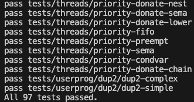

# PintOS DUP2 SYSCALL

## 문제의 시작
``` c
struct task {
    char *name;                 /* Name of the process. */
    pid_t pid;                  /* Process ID. */
    struct thread *thread;      /* The thread currently running the task. */
    pid_t parent_pid;           /* PID of parent process. */
    struct list_elem elem;      /* List element for PCB */
    struct list_elem celem;     /* List element for child process. */
    struct fd fds[MAX_FD];      /* File descriptor table. */
    struct semaphore fork_lock; /* Lock for fork system call. */
    struct semaphore wait_lock; /* Lock for wait system call. */
    struct list children;       /* List of child processes. */
    struct intr_frame *if_;     /* Temporary interrupt frame. */
    struct file* executable;    /* Executable file. */
    enum process_status status; /* Status of the process. */
    int exit_code;              /* Exit code. */
    void *args;                 /* Temporary argument for deterministic
                                   creation of processes. */
};
```
fd를 배열로 만든 결과 문제가 발생합니다. 유닉스 스킴을 따르라는 말이 fdtable을 만들어서 하라는 뜻인줄 몰랐습니다. 정상적인 구현은 아마도 해시 테이블을 이용한 구현이었을 것 입니다.

``` c
  int fd1, fd2 = 0x1CE; // ?

  // ...
  
  // ??
  CHECK (dup2 (fd1, fd2) > 1, "first dup2()");
```

이제 선택지는 두 가지 입니다.
1. fdtable을 해시테이블로 다시 설계하기
2. 잘못을 인정하지 않고 어떻게 해결해보기

## 매핑의 필요성
재설계를 안하기로 했으므로 어떻게든 기존 코드를 작동하도록 만들어야합니다. 이제 배열의 인덱스보다 높은 fd를 저장해야되기 때문에 더 이상 배열의 인덱스와 fd를 1:1로 매핑할 수 없습니다. 따라서 매핑을 위한 변수가 필요합니다.
``` c
struct fd {
    fd_t fd_map; // NEW
    bool closed;
    struct file *file;
};

fd_t 
task_find_fd_map (struct task *task, int fd) {
    for (size_t i = 0; i < MAX_FD; i++) {
        if (fd == task->fds[i].fd_map) {
            return i;
        }
    }

    return -1;
}
```

## 복제 여부와 복제 횟수
이제 복제 여부를 표시하고 복제 횟수를 세야합니다. 어떤 파일 디스크립터가 얼마만큼 복제되었는지를 저장해야합니다. 복제하려는 파일 디스크립터가 다른 파일 디스크립터를 복제한 것이라면 원본 파일 디스크립터의 복제 횟수를 올려주어야합니다. 이를 해결하기 위해서 **서로소 집합**처럼 작동하도록 만들었습니다. `task_find_original_fd`는 원본을 재귀적으로 찾아나갑니다.

``` c
struct fd {
    fd_t fd;            // NEW: property pointing to the parent
    fd_t fd_map;
    bool closed;
    bool duplicated;    // NEW
    struct file *file;
    size_t dup_count;   // NEW
};

fd_t
task_find_original_fd (struct task* task, int fd) {
    int parent_fd = fd;
	int depth = 0;
	while (depth != MAX_FD) {
		parent_fd = task->fds[parent_fd].fd;
		if (parent_fd == task->fds[parent_fd].fd) {
			return parent_fd;
		}
		depth++;
	}

    return -1;
}
```

## FD 상속
만약 원본 파일 디스크립터가 닫히더라도 복제된 파일 디스크립터의 `fd`를 재귀적으로 탐색하면 여전히 원본의 번호를 가리키고 있습니다. 이제부터는 원본 파일 디스크립터가 닫힌다면, 자식 중 하나를 원본으로 만들어야 합니다.

``` c
bool
task_inherit_fd (struct task *task, int fd) {
	/* Find successor first */
	int successor = -1;
	for (size_t i = 0; i < MAX_FD; i++) {
		if (task->fds[i].fd == fd && i != fd) {
			successor = i;
			break;
		}
	}

	if (successor == -1) {
		return false;
	}

	/* Update fd. */
	for (size_t i = 0; i < MAX_FD; i++) {
		if (task->fds[i].fd == fd && i != fd) {
			task->fds[i].fd = successor;
		}
	}

	/* Update succssor. */
	task->fds[successor].duplicated = false;
	task->fds[successor].dup_count = task->fds[fd].dup_count - 1;
	task->fds[successor].stdio = task->fds[fd].stdio;
	return true;
}
```

## Standard IO 문제
다음과 같은 상황을 고려해봅시다.

``` c
dup2 (1, 5);
close (1);
close (0);
dup2 (5, 1);
close (5);
dup2 (1, 0);
```
이 코드를 실행하고나면 fd `0`은 `stdout`이 되어야합니다. 하지만 지금까지 `read`와 `write`에서 fd와 0, 혹은 1인지, 그리고 file 속성이 NULL인지만 확인했습니다. 이를 수정하지 않으면 `0`은 다시 `stdin`으로 취급됩니다. 그리고, `dup2 (1, 5)`를 수행하고 `close (1)`을 하는 순간 fd 상속이 일어나서 fd `5`가 표준 입력인지, 표준 출력인지 알 수 없게 됩니다.

``` c
struct fd {
    fd_t fd;
    fd_t fd_map;
    bool closed;
    bool duplicated;
    struct file *file;
    size_t dup_count;
    fd_t stdio;     // NEW
};
```
새로운 속성 `stdio`를 추가하면 이러한 문제를 해결할 수 있습니다. `stdio`는 기본적으로 -1로 해야합니다. fd `0`, `1`, `2`만 초기에 -1이 아닌 값을 가집니다. 이제 표준 입출력에 읽거나 쓸 때 `stdio` 속성만을 확인합니다.

``` c
static int
syscall_read (int fd, void *buffer, size_t len) {
    // ...
    if (task->fds[fd].stdio == 0) {
		for (size_t i = 0; i < size; i++) {
			bool result = put_user (buffer + i, input_getc());
			if (!result) {
				task_exit (-1);
			}
		}

		return size;
    }
    // ...
}

static int
syscall_write (int fd, void *buffer, size_t len) {
    // ...
    if (task->fds[fd].stdio == 1) {
		putbuf(buffer, size);
		return size;
	}
    // ...
}
```
## 성공!
